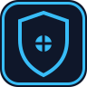
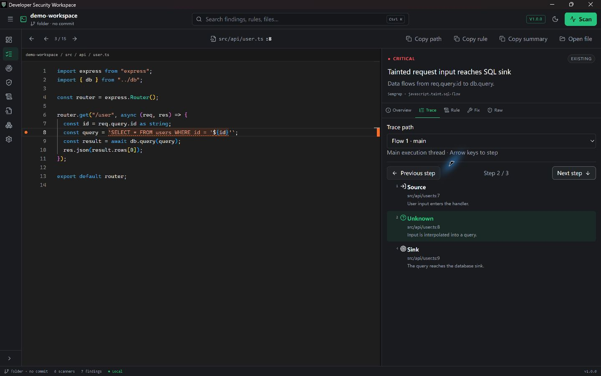

<div align="center">



# Developer Security Workspace

**Local-first security investigation for SARIF and scanner findings.**

**Status:** 🟢 Production

[Download](https://github.com/styayur/developer-security-workspace/releases/latest) · [Documentation](docs/architecture.md) · [Demo](docs/demo-workspace.md) · [Discussions](https://github.com/styayur/developer-security-workspace/discussions)

[](https://github.com/styayur/developer-security-workspace/releases/latest)
[](https://github.com/styayur/developer-security-workspace/actions/workflows/ci.yml)
[](LICENSE)
[]()
[]()
[]()



</div>

## Why DSW

Scanners are replaceable producers. Security IR and the investigation workflow are the product.

A finding is a debuggable object: source location, independent data-flow paths, rule/CWE metadata, proposed fixes, provenance and a redacted raw result. DSW keeps that investigation local in a resizable IDE-style workbench.

## Core workflow

1. Open a repository or import SARIF 2.1.0.
2. Filter SQLite-backed finding pages and open a finding in Monaco.
3. Choose a trace path, step through source/propagation/sink, and inspect rule, fix and raw evidence.
4. Compare scans with explained Native/Exact/Context/Relocated matches.
5. Save triage on a stable identity so decisions survive rescanning.

**Try Demo Workspace** creates two synthetic scans with SQL injection, cross-file trace, a parameterized-query fix, redacted secret, dependency and IaC findings. [Follow the interactive tutorial](docs/demo-workspace.md).

## Screenshots

The first product screenshot must show the real Finding Debugger, Monaco and Trace together. [Capture instructions and asset locations](docs/assets/README.md) are ready; no generated mock screenshot is presented as a working product.

## Capabilities

| Capability | Implementation |
| --- | --- |
| Stable internal protocol | Security IR v1, versioned provenance and normalization goldens |
| Finding identity | Native, exact, source-context and deterministic semantic evidence; ambiguous collisions stay separate |
| Lifecycle and triage | First/last seen, occurrences, Fixed/Reopened; identity-bound decisions and notes |
| Scan comparison | New, Existing, Fixed, Reopened, Changed; paginated result buckets |
| Trace Debugger | Thread selection, cross-file Monaco ranges, Step n/N, keyboard Previous/Next |
| Large result sets | SQLite filters/counts, 100-row UI pages, bounded IPC, lazy raw-result references |
| Local persistence | Transactional schema migrations preserve Preview projects/history/triage |
| Scanner extensions | Reviewed declarative Gitleaks profile, explicit manifest/binary approval, no plugin scripts |
| Import/export | SARIF 2.1.0 with existing compatibility adapters |

## Scanner matrix

All existing real providers remain available. Scanner binaries are installed separately and never silently downloaded by DSW.

| Producer | Input to DSW | Notes |
| --- | --- | --- |
| Semgrep | Native SARIF | Metrics disabled; user-selected rules/config |
| Trivy | Native SARIF | SCA, secrets, configuration, containers and licenses |
| TruffleHog | Trusted JSON adapter | Raw candidate values removed; verification follows scanner settings |
| Bandit | SARIF / trusted JSON adapter | Formatter fallback retains rule, severity, confidence and CWE |
| Gitleaks extension | Native SARIF file | Explicit approval; reviewed offline/read-only profile |
| CodeQL and other tools | Imported SARIF | CodeQL runtime remains user-provided; no engine bundled |

[Provider details and historical verified versions](docs/scanner-providers.md) · [Extension security boundary](docs/extension-model.md)

## Architecture

```text
Scanner / SARIF -> normalize + redact -> Security IR v1
                                      -> layered matcher -> identity + occurrence
                                      -> SQLite -> paginated inbox -> Monaco / trace / triage
```

React/TypeScript + Monaco; Tauri 2; Rust; local SQLite. No localhost backend, database server, Electron, cloud service or AI matching. [Protocol, matching and migration policy](docs/architecture.md).

## Install

Download the Windows x64 NSIS installer and SHA256SUMS from [GitHub Releases](https://github.com/styayur/developer-security-workspace/releases). Windows 10/11 and WebView2 are required. Current v1.x releases use a self-signed Authenticode certificate; it does not provide public-CA trust or remove SmartScreen. The public certificate and checksums accompany the release. See [signature verification](docs/release.md).

## Development

```powershell
pnpm install --frozen-lockfile
pnpm typecheck
pnpm test
pnpm build
cargo fmt --manifest-path src-tauri/Cargo.toml --all -- --check
cargo clippy --manifest-path src-tauri/Cargo.toml --all-targets -- -D warnings
cargo test --manifest-path src-tauri/Cargo.toml
pnpm tauri dev
```

Windows desktop validation additionally uses `--features desktop`. Build an installer with `pnpm tauri build` (MSVC C++ Build Tools required), or use the existing [GNU fallback](scripts/build-windows-gnu.ps1) with an installed GNU/MinGW toolchain. [CI and release operations](docs/release.md).

Generate performance inputs with `node scripts/generate-large-sarif.mjs 50000 work/large-50000.sarif`. [Benchmarks and limits](docs/performance.md).

## Security and privacy

Source reads stay within the canonical workspace. Scanner processes use executable + argv, with bounded logs, deadlines and cancellation. SARIF/log redaction runs before persistence and UI log events. Context fingerprint metadata contains only hashes.

DSW has no account, telemetry, analytics or cloud storage. External scanners may have their own network/database/credential-verification behavior. Extension permission declarations are not an OS sandbox for a malicious native binary. [Security model](docs/security-model.md) · [Private vulnerability reporting](SECURITY.md).

## Known limits

- SARIF import streams through disk-backed staging with cancellation: 1 GiB input, 2 MiB per result/value, 8 MiB metadata. Scanner machine output remains capped at 128 MiB; full Raw inspection at 8 MiB.
- Duplicate ambiguous findings remain unmatched; v1 does not match across different rules or conflicting symbols.
- Extension execution currently supports the reviewed Gitleaks profile only; arbitrary native commands/custom converters are disabled.
- Full CodeQL database analysis and Authenticode signing are outside this Preview.
- 100k synthetic imports pass locally (about 1.32 GiB peak in a debug test); low-memory profiling and real desktop screenshots remain separate validation work.

## Roadmap

### Current

- Stable SARIF 2.1.0 import and the Finding Debugger workflow on Windows.
- Scanner adapters with per-scanner provenance and licensing notes.
- Signed Windows releases with `SHA256SUMS.txt`.

### Next

- Broaden scanner-adapter coverage and triage/export formats.
- Resolve the remaining upstream GTK/glib advisory when the Tauri dependency chain allows.

### Future

- A documented plugin contract for custom scanners and report converters.
- Linux/macOS packaging for the same investigation workflow.

### Not planned

- Cloud or telemetry backends; findings stay local by design.
- Bundling third-party scanners under incompatible licenses.

## Community

- **GitHub Issues** for reproducible bugs and scoped engineering tasks.
- **GitHub Discussions** for implementation ideas, provider/plugin design, architecture, roadmap, showcase, and usage questions.
- **Discord** for informal feedback and early discussion: https://discord.gg/wA2xy6VPK. It is not the security disclosure channel.
- **Security** reports must use private vulnerability reporting and [SECURITY.md](SECURITY.md), never Discord or a public issue.
- Releases use SemVer `vX.Y.Z`, are built from exact tags, and include `SHA256SUMS.txt`; maintainers perform publication.

## Licensing

Application source: **AGPL-3.0-only** ([LICENSE](LICENSE)). Optional scanners retain their own terms and are not bundled. See [NOTICE](NOTICE.md), [third-party licenses](THIRD_PARTY_LICENSES.md), and [licensing](docs/licensing.md).

This project is not affiliated with or endorsed by any scanner vendor.
